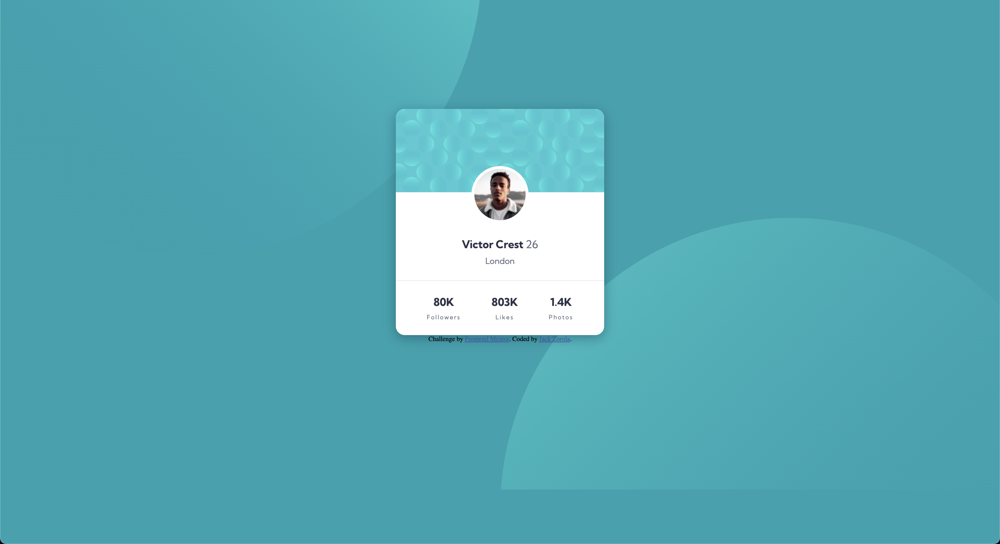

# Frontend Mentor - Profile card component solution

This is a solution to the [Profile card component challenge on Frontend Mentor](https://www.frontendmentor.io/challenges/profile-card-component-cfArpWshJ). Frontend Mentor challenges help you improve your coding skills by building realistic projects. 

## Table of contents

- [Overview](#overview)
  - [The challenge](#the-challenge)
  - [Screenshot](#screenshot)
  - [Links](#links)
- [My process](#my-process)
  - [Built with](#built-with)
  - [What I learned](#what-i-learned)
- [Author](#author)

## Overview
### The challenge
- Your challenge is to build out this profile card component and get it looking as close to the design as possible.

You can use any tools you like to help you complete the challenge. So if you've got something you'd like to practice, feel free to give it a go.

### Screenshot

### Links
- [Solution URL here](https://github.com/jackzorola10/profile-card-component-main)
- [Live Site URL](https://jackzorola10.github.io/profile-card-component-main/)

## My process
### Built with

- Semantic HTML5 markup
- Flexbox
- Media Queries
- Mobile-first workflow

### What I learned
This is the first one of the challenges I did with a relatively high Lighthouse Report Score. Some of the points mentioned to fix was the fact that the _"Document doesn't use legible font sizes"_ but these were as specified in the Figma design. 

I think it makes a good point about the communication between development and design, to let them know about these specific type of issues. 

## Author
- Website - [jackzorola10](https://github.com/jackzorola10)
- Frontend Mentor - [@jackzorola10](https://www.frontendmentor.io/profile/jackzorola10)
- Twitter - [@jackzorola](https://www.twitter.com/jackzorola)
- Spotify - [@kayvsthemoon](https://open.spotify.com/artist/1lPbVyRwZyaT3O1JeDRyTY)

